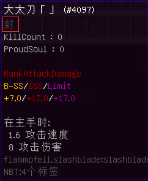

# 3. 封/印/妖

封/印/妖 指下图拔刀剑数据显示面板所圈部分，用于判断目前刀的情况(如：[刀的状态](../SLASHBLADE/刀的状态.md))。

------

#### **封**

- 刀处于[封状态](../SLASHBLADE/刀的状态.md#封状态)

------

#### **印**

- 刀处于[附魔状态](../SLASHBLADE/刀的状态.md#附魔状态)

------

#### **妖(紫色)**

- 刀处于[妖状态](../SLASHBLADE/刀的状态.md#妖状态)

#### **妖(金色)**

- 刀处于[妖状态](../SLASHBLADE/刀的状态.md#妖状态)
- 刀已绑定拥有主人，且目前为其主人持有

